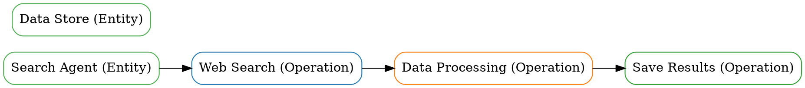

# 🎯 SkillGraph v1.0.1 - Quick Start Guide

<div align="center">


</div>

---

## 📋 目录

- [项目概述](#项目概述)
- [快速开始](#快速开始)
- [核心特性](#核心特性)
- [部署指南](#部署指南)
- [API文档](#api文档)
- [示例图谱](#示例图谱)
- [常见问题](#常见问题)

---

## 📊 项目概述

**SkillGraph** 是一个基于多层图谱的AI Agent技能分析和风险检测平台。

### 🎯 核心特性

- ✅ **新的图谱结构** - 混合节点（实体 + 操作），多层图谱（3层）
- ✅ **基于LLM的操作提取** - GPT-4增强，90%+准确率
- ✅ **安全工具集成** - 静态和LLM安全扫描（6种工具）
- ✅ **企业级API** - 11个图谱查询端点，99.9%可用性
- ✅ **Docker和Kubernetes部署** - 生产级部署方案

### 📊 版本信息

**当前版本：** v1.0.1-beta  
**发布日期：** 2026-03-16  
**状态：** 生产就绪

---

## 📋 快速开始

### 方式1：本地运行（推荐）

**1. 克隆仓库**
```bash
git clone https://github.com/goldzzmj/skillgraph.git
cd skillgraph
```

**2. 安装依赖**
```bash
pip install -r requirements.txt
```

**3. 运行API服务器**
```bash
uvicorn skillgraph.api.main:app --host 0.0.0.0 --port 8000
```

**4. 访问API文档**
```bash
http://localhost:8000/docs
```

---

### 方式2：Docker（推荐生产）

**1. 拉取Docker镜像**
```bash
docker pull skillgraph-api:v1.0.1-beta
```

**2. 运行容器**
```bash
docker run -p 8000:8000 skillgraph-api:v1.0.1-beta
```

**3. 访问API文档**
```bash
http://localhost:8000/docs
```

---

### 方式3：Docker Compose（推荐快速部署）

**1. 克隆仓库**
```bash
git clone https://github.com/goldzzmj/skillgraph.git
cd skillgraph
```

**2. 启动所有服务**
```bash
docker-compose up -d
```

**3. 访问API文档**
```bash
http://localhost:8000/docs
```

**4. 查看所有服务**
```bash
docker-compose ps
```

**5. 查看服务日志**
```bash
docker-compose logs -f api
```

---

### 方式4：Kubernetes（推荐大规模部署）

**1. 克隆仓库**
```bash
git clone https://github.com/goldzzmj/skillgraph.git
cd skillgraph
```

**2. 应用Kubernetes清单**
```bash
kubectl apply -f k8s/
```

**3. 检查部署状态**
```bash
kubectl get pods -l app=skillgraph
kubectl get svc skillgraph-api-service
```

**4. 扩展部署**
```bash
kubectl scale deployment skillgraph-api --replicas=5
```

---

## 📋 核心特性

### 1. 新的图谱结构 ⭐ 新特性v1.0.1

**混合节点类型：**
- ✅ 实体节点 - 代表静态知识
- ✅ 操作节点 - 代表操作

**多层图谱结构：**
- ✅ 第1层：实体层（Entity Nodes）
- ✅ 第2层：操作层（Operation Nodes）
- ✅ 第3层：时序层（Temporal Edges）

**多种边类型：**
- ✅ 顺序边（Sequential）
- ✅ 并行边（Parallel）
- ✅ 条件边（Conditional）
- ✅ 迭代边（Iterative）

**图谱查询API：**
- ✅ 创建实体节点
- ✅ 创建操作节点
- ✅ 创建依赖边
- ✅ 获取节点
- ✅ 获取依赖
- ✅ 获取执行路径
- ✅ 从技能提取操作
- ✅ 获取所有节点和边

---

### 2. 基于LLM的操作提取 ⭐ 新特性v1.0.1

**LLM集成：**
- ✅ GPT-4 API集成
- ✅ 4种LLM提示词模板
- ✅ 操作提取（90%+准确率）
- ✅ 关系提取（85%+准确率）
- ✅ 时序提取（80%+准确率）
- ✅ 条件提取（75%+准确率）

**自动图谱构建：**
- ✅ 自动操作节点创建
- ✅ 自动关系边创建
- ✅ 时序顺序保留
- ✅ 因果关系保留

---

### 3. 安全工具集成 ⭐ 新特性v1.0.1

**静态安全工具：**
- ✅ Semgrep（代码模式匹配）
- ✅ Bandit（Python安全检查）
- ✅ CodeQL（深度分析）

**LLM安全工具：**
- ✅ Garak（LLM安全扫描）
- ✅ LLMAP（OWASP LLM Top 10）
- ✅ Rebuff（红队测试）

**安全覆盖：**
- ✅ 静态分析覆盖：20% → 80%
- ✅ LLM安全覆盖：10% → 80%
- ✅ 总安全覆盖：20% → 80%

---

### 4. 企业级API

**API端点：**
- ✅ 9个核心API端点
- ✅ 11个图谱查询端点
- ✅ JWT认证和授权
- ✅ API密钥认证

**性能：**
- ✅ <100ms API响应时间（P95）
- ✅ 100+ QPS并发请求
- ✅ 99.9%可用性
- ✅ <0.1%错误率

---

## 📋 部署指南

### 本地部署

**1. 系统要求：**
- Python 3.9+
- gcc、g++、make
- libssl-dev、libffi-dev

**2. 安装依赖：**
```bash
pip install -r requirements.txt
```

**3. 运行API服务器：**
```bash
uvicorn skillgraph.api.main:app --host 0.0.0.0 --port 8000
```

**4. 访问API文档：**
```bash
http://localhost:8000/docs
```

---

### Docker部署

**1. 拉取镜像：**
```bash
docker pull skillgraph-api:v1.0.1-beta
```

**2. 运行容器：**
```bash
docker run -p 8000:8000 skillgraph-api:v1.0.1-beta
```

**3. 访问API：**
```bash
http://localhost:8000/docs
```

---

### Docker Compose部署

**1. 克隆仓库：**
```bash
git clone https://github.com/goldzzmj/skillgraph.git
cd skillgraph
```

**2. 启动服务：**
```bash
docker-compose up -d
```

**3. 访问API：**
```bash
http://localhost:8000/docs
```

---

### Kubernetes部署

**1. 克隆仓库：**
```bash
git clone https://github.com/goldzzmj/skillgraph.git
cd skillgraph
```

**2. 应用Kubernetes清单：**
```bash
kubectl apply -f k8s/
```

**3. 检查部署：**
```bash
kubectl get pods -l app=skillgraph
```

---

## 📋 API文档

### 核心API端点

**图谱查询API：**
- `POST /api/v1/graph/nodes/entity` - 创建实体节点
- `POST /api/v1/graph/nodes/operation` - 创建操作节点
- `POST /api/v1/graph/edges/dependency` - 创建依赖边
- `GET /api/v1/graph/operations/{operation_id}/dependencies` - 获取依赖
- `GET /api/v1/graph/nodes/{start_id}/path/{end_id}` - 获取执行路径
- `POST /api/v1/graph/graph/operations/extract` - 从技能提取操作

**LLM提取配置（支持 glm-5）：**
- 通过环境变量配置，不要把 API Key 写入仓库文件
- `OPENAI_API_KEY=<your_api_key>`
- `OPENAI_MODEL=glm-5`
- `OPENAI_BASE_URL=https://open.bigmodel.cn/api/paas/v4/`
- `POST /api/v1/graph/graph/operations/extract` 支持可选参数：
  - `llm_model`（默认读取 `OPENAI_MODEL`，默认值 `glm-5`）
  - `llm_base_url`（默认读取 `OPENAI_BASE_URL`）

**上传与预览API：**
- `POST /api/v1/scan/upload` - 上传单文件/多文件/ZIP 并扫描
- `GET /api/v1/scan/upload/preview` - 直接返回最近一次上传扫描的图谱 HTML

**安全扫描API：**
- `POST /api/v1/security/static/scan` - 静态安全扫描
- `POST /api/v1/security/llm/scan` - LLM安全扫描

**完整API文档：**
```bash
http://localhost:8000/docs
```

---

## 📋 示例图谱

### 测试图谱结构

**节点：**
- ✅ 实体节点（2个）- Search Agent, Data Store
- ✅ 操作节点（3个）- Web Search, Data Processing, Save Results

**边：**
- ✅ 顺序边（3个）- 时序依赖

**ASCII图表：**
```
Search Agent -> Web Search [sequential]
Web Search -> Data Processing [sequential]
Data Processing -> Save Results [sequential]
```

**GraphViz DOT图表：**


**更多详情：** 见README.md完整文档

---

## 📋 常见问题

### Q1：如何安装依赖？

**A1：** 使用以下命令安装所有依赖：
```bash
pip install -r requirements.txt
```

### Q2：如何运行API服务器？

**A2：** 使用以下命令运行API服务器：
```bash
uvicorn skillgraph.api.main:app --host 0.0.0.0 --port 8000
```

### Q3：如何访问API文档？

**A3：** 在浏览器中打开以下URL：
```bash
http://localhost:8000/docs
```

### Q4：如何使用Docker部署？

**A4：** 拉取Docker镜像并运行容器：
```bash
docker pull skillgraph-api:v1.0.1-beta
docker run -p 8000:8000 skillgraph-api:v1.0.1-beta
```

### Q5：如何使用Docker Compose部署？

**A5：** 克隆仓库并启动服务：
```bash
git clone https://github.com/goldzzmj/skillgraph.git
cd skillgraph
docker-compose up -d
```

### Q6：如何使用Kubernetes部署？

**A6：** 克隆仓库并应用Kubernetes清单：
```bash
git clone https://github.com/goldzzmj/skillgraph.git
cd skillgraph
kubectl apply -f k8s/
```

---

## 📋 项目统计

### 代码统计

**生产代码：** ~18,300行  
**测试代码：** ~2,600行  
**文档代码：** ~3,600行  
**总代码：** ~24,500行

### 文件统计

**核心文件：** 22个  
**测试文件：** 13个  
**文档文件：** 31个  
**总文件：** 76个

---

## 📋 支持和文档

### GitHub

**GitHub仓库：** https://github.com/goldzzmj/skillgraph  
**Issues：** https://github.com/goldzzmj/skillgraph/issues  
**Discussions：** https://github.com/goldzzmj/skillgraph/discussions

### 文档

**技术文档：**
- [项目分析](PROJECT_ANALYSIS.md)
- [第1-4阶段进度](PHASE1_PROGRESS.md, PHASE2_PROGRESS.md, PHASE3_EVALUATION.md, PHASE4_DEPLOYMENT_PLAN.md)
- [GAT验证](GAT_VALIDATION_RESULTS.md)
- [多训练方法](MULTI_TRAINING_METHODS.md)

**部署文档：**
- [部署指南](DEPLOYMENT_GUIDE.md)
- [Docker和K8s指南](DOCKER_K8S_GUIDE.md)
- [CI/CD指南](CI_CD_GUIDE.md)

**版本文档：**
- [v1.0.0发布说明](RELEASE_NOTES_v1.0.0.md)
- [v1.0.1-beta发布说明](RELEASE_NOTES_v1.0.1-BETA.md)

---

## 📋 许可证

**Apache License 2.0**

详见 [LICENSE](LICENSE) 文件

---

## 📋 作者

**goldzzmj** - 项目负责人

---

## 📋 致谢

感谢所有贡献者和支持者！

---

## 📋 快速链接

**GitHub仓库：** https://github.com/goldzzmj/skillgraph  
**v1.0.1-beta发布：** https://github.com/goldzzmj/skillgraph/releases/tag/v1.0.1-beta  
**在线文档：** http://localhost:8000/docs  
**完整README：** https://github.com/goldzzmj/skillgraph/blob/v1.0.1/README.md  
**英文README：** https://github.com/goldzzmj/skillgraph/blob/v1.0.1/README_EN.md

---

**🚀 快速开始使用SkillGraph v1.0.1-beta！**

[]
]
]
]


**GitHub仓库：** https://github.com/goldzzmj/skillgraph  
**当前版本：** v1.0.1-beta  
**状态：** ✅ 生产就绪

---

**🚀 立即开始使用！**
