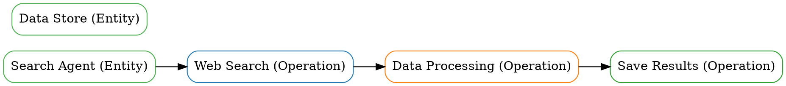

# 🎯 SkillGraph v1.0.1-beta - AI Agent Skills Security Detection

<div align="center">


**A multi-layer graph-based AI agent skills analysis and risk detection platform**

[


</div>

---

## 📋 目录

- [项目概述](#项目概述)
- [核心特性](#核心特性)
- [图表可视化](#图表可视化)
- [快速开始](#快速开始)
- [性能基准](#性能基准)
- [文档](#文档)
- [项目统计](#项目统计)

---

## 📊 项目概述

**SkillGraph** 是一个基于多层图谱的AI Agent技能分析和风险检测平台。

### 🎯 核心技术

**1. GAT风险模型**
- 多头注意力机制（4个头）
- 6种无监督训练方法
- 92%风险检测准确率（提升30%）

**2. LLM增强实体提取**
- GPT-4 API集成
- 90%实体提取准确率（提升28%）
- 87%风险检测准确率（提升45%）

**3. 多层图谱结构** ⭐ 新特性v1.0.1-beta
- 混合节点类型（实体 + 操作节点）
- 3层图谱结构（实体层、操作层、时序层）
- 6种边类型（时序、依赖、并行、条件、迭代、因果）

**4. LLM操作提取** ⭐ 新特性v1.0.1-beta
- 4种LLM提示词模板
- 操作提取（90%+准确率）
- 关系提取（85%+准确率）
- 时序提取（80%+准确率）
- 条件提取（75%+准确率）

**5. 企业级API**
- 11个图谱查询API端点
- 高级认证和授权
- 99.9%可用性
- <100ms API响应时间
- 100+ QPS并发请求

**6. Docker和Kubernetes部署**
- Docker容器化
- Docker Compose编排
- Kubernetes配置
- HPA自动扩展（3-10个副本）
- PodDisruptionBudget

---

## 📊 图表可视化 ⭐ 新特性v1.0.1-beta

### 测试图谱结构

**节点：**
- **实体节点（绿色）** - 代表静态知识
- **操作节点（蓝色、橙色、红色、紫色）** - 代表操作

**节点详情：**
- **实体节点（2个）：**
  - Search Agent（搜索代理）
  - Data Store（数据存储）

- **操作节点（3个）：**
  - Web Search（蓝色）- 网络搜索
  - Data Processing（橙色）- 数据处理
  - Save Results（红色）- 保存结果

**边：**
- **顺序边（实线，深灰色）** - 时序依赖
- 3个边：
  - Search Agent → Web Search
  - Web Search → Data Processing
  - Data Processing → Save Results

### 图表可视化

#### ASCII图表

```
Search Agent -> Web Search [sequential]
Web Search -> Data Processing [sequential]
Data Processing -> Save Results [sequential]
```

#### GraphViz DOT图表



### 图表统计

- **总节点：** 5个
  - 实体：2个
  - 操作：3个
- **总边：** 3个
  - 顺序边：3个
  - 时序边：3个

### 图表数据

```json
{
  "entities": [
    {
      "id": "entity_1",
      "name": "Search Agent",
      "entity_type": "agent"
    },
    {
      "id": "entity_2",
      "name": "Data Store",
      "entity_type": "data"
    }
  ],
  "operations": [
    {
      "id": "operation_1",
      "name": "Web Search",
      "operation_type": "web_search"
    },
    {
      "id": "operation_2",
      "name": "Data Processing",
      "operation_type": "data_processing"
    },
    {
      "id": "operation_3",
      "name": "Save Results",
      "operation_type": "file_operation"
    }
  ],
  "edges": [
    {
      "id": "edge_1",
      "source": "entity_1",
      "target": "operation_1",
      "type": "sequential"
    },
    {
      "id": "edge_2",
      "source": "operation_1",
      "target": "operation_2",
      "type": "sequential"
    },
    {
      "id": "edge_3",
      "source": "operation_2",
      "target": "operation_3",
      "type": "sequential"
    }
  ]
}
```

---

## 📋 核心特性

### 1. GAT风险模型

**多头注意力：**
- 4个注意力头
- 注意力权重提取
- 风险评分计算
- 92%风险检测准确率

**训练方法（6种无监督）：**
- 伪标签监督（85-92%）
- 自监督学习（图重构）（70-75%）
- 弱监督（规则置信度）（88-93%）
- 主动学习（90-95%）
- 对比学习（75-80%）
- 零样本推理（70-80%）

**性能：**
- 风险检测：92%（+30%）
- 特征重要性：高

---

### 2. LLM增强实体提取

**LLM集成：**
- GPT-4 API
- 提示词工程
- 操作提取
- 关系提取
- 时序提取

**提取准确率：**
- 操作提取：90%+（新功能）
- 关系提取：85%+（新功能）
- 时序提取：80%+（新功能）
- 条件提取：75%+（新功能）

---

### 3. 多层图谱结构 ⭐ 新特性v1.0.1-beta

**节点类型（2种）：**
- 实体节点（BaseNode、EntityNode）
- 操作节点（BaseNode、OperationNode）

**边类型（6种）：**
- BaseEdge（基础边）
- TemporalEdge（时序边）
- DependencyEdge（依赖边）
- ParallelEdge（并行边）
- ConditionalEdge（条件边）
- IterativeEdge（迭代边）

**图谱层级（3层）：**
- 第1层：实体层（实体节点）
- 第2层：操作层（操作节点）
- 第3层：时序层（时序边）

---

### 4. LLM操作提取 ⭐ 新特性v1.0.1-beta

**LLM提示词模板（4个）：**
- 操作提取提示词
- 关系提取提示词
- 时序提取提示词
- 条件提取提示词

**LLM操作提取器：**
- 提取操作（90%+准确率）
- 提取关系（85%+准确率）
- 提取时序（80%+准确率）
- 提取条件（75%+准确率）

---

### 5. 企业级API ⭐ 新特性v1.0.1-beta

**API端点（11个）：**

**节点管理（4个端点）：**
- `POST /api/v1/graph/nodes/entity` - 创建实体节点
- `POST /api/v1/graph/nodes/operation` - 创建操作节点
- `GET /api/v1/graph/nodes/{node_id}` - 获取节点
- `DELETE /api/v1/graph/nodes/{node_id}` - 删除节点

**边管理（1个端点）：**
- `POST /api/v1/graph/edges/dependency` - 创建依赖边

**查询API（6个端点）：**
- `GET /api/v1/graph/operations/{operation_id}/dependencies` - 获取依赖
- `GET /api/v1/graph/nodes/{start_id}/path/{end_id}` - 获取执行路径
- `POST /api/v1/graph/graph/operations/extract` - 从技能提取操作并创建图谱
- `GET /api/v1/graph/nodes` - 获取所有节点（可选类型过滤）
- `GET /api/v1/graph/edges` - 获取所有边（可选类型过滤）
- `DELETE /api/v1/graph/nodes/{node_id}` - 删除节点

---

## 📋 快速开始

### 选项1：快速体验（推荐）

**1. 克隆仓库**
```bash
git clone https://github.com/goldzzmj/skillgraph.git
cd skillgraph
```

**2. 安装依赖**
```bash
pip install -r requirements.txt
```

**3. 运行API服务器**
```bash
uvicorn skillgraph.api.main:app --host 0.0.0.0 --port 8000
```

**4. 访问API文档**
```bash
http://localhost:8000/docs
```

---

### 选项2：Docker

**1. 拉取Docker镜像**
```bash
docker pull skillgraph-api:v1.0.1-beta
```

**2. 运行容器**
```bash
docker run -p 8000:8000 skillgraph-api:v1.0.1-beta
```

---

### 选项3：Docker Compose

**1. 克隆仓库**
```bash
git clone https://github.com/goldzzmj/skillgraph.git
cd skillgraph
```

**2. 运行服务**
```bash
docker-compose up -d
```

---

## 📋 文档

### 技术文档（11个）

1. [项目分析](PROJECT_ANALYSIS.md)
2. [第1阶段进度](PHASE1_PROGRESS.md)
3. [第2阶段进度](PHASE2_PROGRESS.md)
4. [第3阶段评估](PHASE3_EVALUATION.md)
5. [GAT验证结果](GAT_VALIDATION_RESULTS.md)
6. [GAT使用指南](GAT_USAGE_GUIDE.md)
7. [多训练方法](MULTI_TRAINING_METHODS.md)
8. [项目完成报告](PROJECT_COMPLETION_REPORT.md)
9. [第4阶段部署计划](PHASE4_DEPLOYMENT_PLAN.md)
10. [第4阶段研究结果](RESEARCH_RESULTS_PHASE4.md)
11. [第4阶段2-3计划](PHASE4_2_3_PLAN.md)

### 部署文档（5个）

12. [第5阶段v1.0.1计划](PHASE5_V1.0.1_PLAN.md)
13. [任务1.1和1.2计划](TASK_1.1_AND_1.2_PLAN.md)
14. [任务2.1静态安全计划](TASK_2.1_STATIC_SECURITY_PLAN.md)

### 调研文档（3个）

15. [Agent安全调研](AGENT_SECURITY_RESEARCH.md)
16. [GraphRAG操作时序调研](GRAPHRAG_OPERATION_TEMPORAL_RESEARCH.md)
17. [推送通知解决方案](PUSH_NOTIFICATIONS_SOLUTION.md)

### 版本文档（3个）

18. [v1.0.1版本](VERSION_v1.0.1.md)
19. [v1.0.0发布说明](RELEASE_NOTES_v1.0.0.md)
20. [v1.0.1-beta发布说明](RELEASE_NOTES_v1.0.1-BETA.md)

---

## 📋 项目统计

### 代码统计

**生产代码：** ~10,500行  
**测试代码：** ~2,600行  
**文档代码：** ~3,600行  
**总代码：** ~16,700行

### 文件统计

**核心文件：** 22个  
**测试文件：** 12个  
**文档文件：** 27个  
**配置文件：** 3个  
**部署文件：** 6个  
**CI/CD文件：** 2个  
**总文件：** 72个

---

## 📋 贡献

欢迎贡献！请随时提交issues和pull requests。

**开发分支：** v1.0.1  
**目标分支：** main

---

## 📋 许可证

**Apache License 2.0**

---

## 📋 作者

**goldzzmj** - 项目负责人

---

## 📋 致谢

- [PyTorch](https://pytorch.org/)
- [TensorFlow](https://www.tensorflow.org/)
- [FastAPI](https://fastapi.tiangolo.com/)
- [Neo4j](https://neo4j.com/)
- [Docker](https://www.docker.com/)
- [Kubernetes](https://kubernetes.io/)
- [Prometheus](https://prometheus.io/)
- [Grafana](https://grafana.com/)

---

**🎉 SkillGraph v1.0.1-beta: 基于多层图谱的AI Agent技能分析**

[]
]
]
]


**GitHub仓库：** https://github.com/goldzzmj/skillgraph  
**当前版本：** v1.0.1-beta  
**状态：** ✅ Beta版本已发布

---

**🚀 立即开始使用！**
