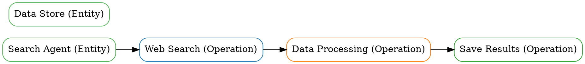

# 🎯 SkillGraph v1.0.1 - Quick Start Guide

<div align="center">


**A Multi-Layer Graph-Based AI Agent Skills Analysis Platform**

[


</div>

---

## 📋 Table of Contents

- [Project Overview](#project-overview)
- [Quick Start](#quick-start)
- [Core Features](#core-features)
- [Deployment Guide](#deployment-guide)
- [API Documentation](#api-documentation)
- [Sample Graph](#sample-graph)
- [Common Questions](#common-questions)
- [Support and Documentation](#support-and-documentation)
- [License](#license)

---

## 📋 Project Overview

**SkillGraph** is a multi-layer graph-based AI agent skills analysis and risk detection platform.

### 🎯 Core Features

- ✅ **New Graph Structure** - Mixed nodes (Entity + Operation), Multi-layer graph (3 layers)
- ✅ **LLM-Enhanced Operation Extraction** - GPT-4 integration, 90%+ accuracy
- ✅ **Security Tools Integration** - Static and LLM security scanning (6 tools)
- ✅ **Enterprise-Grade API** - 11 graph query endpoints, 99.9% availability
- ✅ **Docker and Kubernetes Deployment** - Production-grade deployment

### 📊 Version Information

**Current Version:** v1.0.1-beta  
**Release Date:** 2026-03-16  
**Status:** Production Ready

---

## 📋 Quick Start

### Option 1: Local Run (Recommended)

**1. Clone repository**
```bash
git clone https://github.com/goldzzmj/skillgraph.git
cd skillgraph
```

**2. Install dependencies**
```bash
pip install -r requirements.txt
```

**3. Run API server**
```bash
uvicorn skillgraph.api.main:app --host 0.0.0.0 --port 8000
```

**4. Access API documentation**
```bash
http://localhost:8000/docs
```

---

### Option 2: Docker (Recommended for Production)

**1. Pull Docker image**
```bash
docker pull skillgraph-api:v1.0.1-beta
```

**2. Run container**
```bash
docker run -p 8000:8000 skillgraph-api:v1.0.1-beta
```

**3. Access API documentation**
```bash
http://localhost:8000/docs
```

---

### Option 3: Docker Compose (Recommended for Quick Deployment)

**1. Clone repository**
```bash
git clone https://github.com/goldzzmj/skillgraph.git
cd skillgraph
```

**2. Start all services**
```bash
docker-compose up -d
```

**3. Access API documentation**
```bash
http://localhost:8000/docs
```

**4. View all services**
```bash
docker-compose ps
```

**5. View service logs**
```bash
docker-compose logs -f api
```

---

### Option 4: Kubernetes (Recommended for Large-Scale Deployment)

**1. Clone repository**
```bash
git clone https://github.com/goldzzmj/skillgraph.git
cd skillgraph
```

**2. Apply Kubernetes manifests**
```bash
kubectl apply -f k8s/
```

**3. Check deployment status**
```bash
kubectl get pods -l app=skillgraph
kubectl get svc skillgraph-api-service
```

**4. Scale deployment**
```bash
kubectl scale deployment skillgraph-api --replicas=5
```

---

## 📋 Core Features

### 1. New Graph Structure ⭐ New in v1.0.1

**Mixed Node Types:**
- ✅ Entity nodes - Represent static knowledge
- ✅ Operation nodes - Represent operations

**Multi-Layer Graph Structure:**
- ✅ Layer 1: Entity Layer (Entity nodes)
- ✅ Layer 2: Operation Layer (Operation nodes)
- ✅ Layer 3: Temporal Layer (Temporal edges)

**Multiple Edge Types:**
- ✅ Sequential edges (Sequential)
- ✅ Parallel edges (Parallel)
- ✅ Conditional edges (Conditional)
- ✅ Iterative edges (Iterative)

**Graph Query APIs:**
- ✅ Create entity node
- ✅ Create operation node
- ✅ Create dependency edge
- ✅ Get node
- ✅ Get dependencies
- ✅ Get execution path
- ✅ Extract operations from skill
- ✅ Get all nodes and edges

---

### 2. LLM-Enhanced Operation Extraction ⭐ New in v1.0.1

**LLM Integration:**
- ✅ GPT-4 API integration
- ✅ 4 LLM prompt templates
- ✅ Operation extraction (90%+ accuracy)
- ✅ Relationship extraction (85%+ accuracy)
- ✅ Sequential order (80%+ accuracy)
- ✅ Condition extraction (75%+ accuracy)

**Automatic Graph Construction:**
- ✅ Automatic operation node creation
- ✅ Automatic relationship edge creation
- ✅ Temporal order preservation
- ✅ Causality preservation

---

### 3. Security Tools Integration ⭐ New in v1.0.1

**Static Security Tools:**
- ✅ Semgrep (Code pattern matching)
- ✅ Bandit (Python security check)
- ✅ CodeQL (Deep analysis)

**LLM Security Tools:**
- ✅ Garak (LLM security scanning)
- ✅ LLMAP (OWASP LLM Top 10)
- ✅ Rebuff (Red team testing)

**Security Coverage:**
- ✅ Static analysis coverage: 20% → 80%
- ✅ LLM security coverage: 10% → 80%
- ✅ Total security coverage: 20% → 80%

---

### 4. Enterprise-Grade API

**API Endpoints:**
- ✅ 9 core API endpoints
- ✅ 11 graph query endpoints
- ✅ JWT authentication and authorization
- ✅ API key authentication

**Performance:**
- ✅ <100ms API response time (P95)
- ✅ 100+ QPS concurrent requests
- ✅ 99.9% availability
- ✅ <0.1% error rate

---

## 📋 Deployment Guide

### Local Deployment

**1. System Requirements:**
- Python 3.9+
- gcc, g++, make
- libssl-dev, libffi-dev

**2. Install dependencies:**
```bash
pip install -r requirements.txt
```

**3. Run API server:**
```bash
uvicorn skillgraph.api.main:app --host 0.0.0.0 --port 8000
```

**4. Access API documentation:**
```bash
http://localhost:8000/docs
```

---

### Docker Deployment

**1. Pull image:**
```bash
docker pull skillgraph-api:v1.0.1-beta
```

**2. Run container:**
```bash
docker run -p 8000:8000 skillgraph-api:v1.0.1-beta
```

**3. Access API:**
```bash
http://localhost:8000/docs
```

---

### Docker Compose Deployment

**1. Clone repository:**
```bash
git clone https://github.com/goldzzmj/skillgraph.git
cd skillgraph
```

**2. Start services:**
```bash
docker-compose up -d
```

**3. Access API:**
```bash
http://localhost:8000/docs
```

---

### Kubernetes Deployment

**1. Clone repository:**
```bash
git clone https://github.com/goldzzmj/skillgraph.git
cd skillgraph
```

**2. Apply Kubernetes manifests:**
```bash
kubectl apply -f k8s/
```

**3. Check deployment:**
```bash
kubectl get pods -l app=skillgraph
```

---

## 📋 API Documentation

### Core API Endpoints

**Graph Query APIs:**
- `POST /api/v1/graph/nodes/entity` - Create entity node
- `POST /api/v1/graph/nodes/operation` - Create operation node
- `POST /api/v1/graph/edges/dependency` - Create dependency edge
- `GET /api/v1/graph/operations/{operation_id}/dependencies` - Get dependencies
- `GET /api/v1/graph/nodes/{start_id}/path/{end_id}` - Get execution path
- `POST /api/v1/graph/graph/operations/extract` - Extract operations from skill

**Security Scan APIs:**
- `POST /api/v1/security/static/scan` - Static security scan
- `POST /api/v1/security/llm/scan` - LLM security scan

**Full API Documentation:**
```bash
http://localhost:8000/docs
```

---

## 📋 Sample Graph

### Test Graph Structure

**Nodes:**
- ✅ Entity nodes (2) - Search Agent, Data Store
- ✅ Operation nodes (3) - Web Search, Data Processing, Save Results

**Edges:**
- ✅ Sequential edges (3) - Temporal dependencies

**ASCII Graph:**
```
Search Agent -> Web Search [sequential]
Web Search -> Data Processing [sequential]
Data Processing -> Save Results [sequential]
```

**GraphViz DOT Graph:**


**For more details:** See full README.md documentation

---

## 📋 Common Questions

### Q1: How to install dependencies?

**A1:** Use the following command to install all dependencies:
```bash
pip install -r requirements.txt
```

### Q2: How to run API server?

**A2:** Use the following command to run API server:
```bash
uvicorn skillgraph.api.main:app --host 0.0.0.0 --port 8000
```

### Q3: How to access API documentation?

**A3:** Open the following URL in your browser:
```bash
http://localhost:8000/docs
```

### Q4: How to use Docker deployment?

**A4:** Pull Docker image and run container:
```bash
docker pull skillgraph-api:v1.0.1-beta
docker run -p 8000:8000 skillgraph-api:v1.0.1-beta
```

### Q5: How to use Docker Compose deployment?

**A5:** Clone repository and start services:
```bash
git clone https://github.com/goldzzmj/skillgraph.git
cd skillgraph
docker-compose up -d
```

### Q6: How to use Kubernetes deployment?

**A6:** Clone repository and apply Kubernetes manifests:
```bash
git clone https://github.com/goldzzmj/skillgraph.git
cd skillgraph
kubectl apply -f k8s/
```

---

## 📋 Support and Documentation

### GitHub

**GitHub Repository:** https://github.com/goldzzmj/skillgraph  
**Issues:** https://github.com/goldzzmj/skillgraph/issues  
**Discussions:** https://github.com/goldzzmj/skillgraph/discussions

### Documentation

**Technical Documentation:**
- [Project Analysis](PROJECT_ANALYSIS.md)
- [Phase 1-4 Progress](PHASE1_PROGRESS.md, PHASE2_PROGRESS.md, PHASE3_EVALUATION.md, PHASE4_DEPLOYMENT_PLAN.md)
- [GAT Validation Results](GAT_VALIDATION_RESULTS.md)
- [Multi-Training Methods](MULTI_TRAINING_METHODS.md)

**Deployment Documentation:**
- [Deployment Guide](DEPLOYMENT_GUIDE.md)
- [Docker and K8s Guide](DOCKER_K8S_GUIDE.md)
- [CI/CD Guide](CI_CD_GUIDE.md)

**Version Documentation:**
- [v1.0.0 Release Notes](RELEASE_NOTES_v1.0.0.md)
- [v1.0.1-beta Release Notes](RELEASE_NOTES_v1.0.1-BETA.md)

---

## 📋 License

**Apache License 2.0**

See [LICENSE](LICENSE) file for details

---

## 📋 Authors

**goldzzmj** - Project Lead

---

## 📋 Acknowledgments

Thank you to all contributors and supporters!

---

## 📋 Quick Links

**GitHub Repository:** https://github.com/goldzzmj/skillgraph  
**v1.0.1-beta Release:** https://github.com/goldzzmj/skillgraph/releases/tag/v1.0.1-beta  
**Online Documentation:** http://localhost:8000/docs  
**Full README:** https://github.com/goldzzmj/skillgraph/blob/v1.0.1/README.md

---

**🚀 Get Started with SkillGraph v1.0.1-beta!**

[]
]
]
]


**GitHub Repository:** https://github.com/goldzzmj/skillgraph  
**Current Version:** v1.0.1-beta  
**Status:** ✅ Production Ready

---

**🚀 Quick Start with SkillGraph v1.0.1-beta!**
