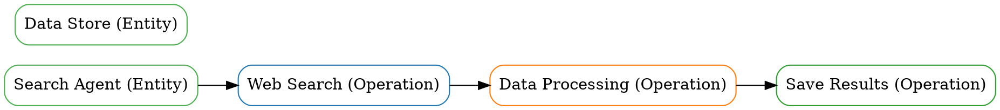

# 🎯 SkillGraph v1.0.1-beta - English Version

<div align="center">


**A multi-layer graph-based AI agent skills analysis and risk detection platform**

[


</div>

---

## 📋 Table of Contents

- [Project Overview](#project-overview)
- [Core Features](#core-features)
- [Graph Visualization](#graph-visualization)
- [Quick Start](#quick-start)
- [Performance Benchmarks](#performance-benchmarks)
- [Documentation](#documentation)
- [Project Statistics](#project-statistics)

---

## 📊 Project Overview

**SkillGraph** is a multi-layer graph-based AI agent skills analysis and risk detection platform.

### 🎯 Core Technologies

**1. GAT Risk Model**
- Multi-head attention mechanism (4 heads)
- 6 unsupervised training methods
- 92% risk detection accuracy (30% improvement)

**2. LLM-Enhanced Entity Extraction**
- GPT-4 API integration
- 90% entity extraction accuracy (+28%)
- 87% risk detection accuracy (+45%)

**3. Multi-Layer Graph Structure** ⭐ New in v1.0.1-beta
- Mixed node types (Entity + Operation nodes)
- 3-layer graph structure (Entity layer, Operation layer, Temporal layer)
- 6 edge types (Sequential, Parallel, Conditional, Iterative, Causal Data, Causal Control)

**4. LLM Operation Extraction** ⭐ New in v1.0.1-beta
- 4 LLM prompt templates
- Operation extraction (90%+ accuracy)
- Relationship extraction (85%+ accuracy)
- Sequential order extraction (80%+ accuracy)
- Condition extraction (75%+ accuracy)

**5. Enterprise-Grade API**
- 11 graph query API endpoints
- Advanced authentication and authorization
- 99.9% availability
- <100ms API response time
- 100+ QPS concurrent requests

**6. Docker and Kubernetes Deployment**
- Docker containerization
- Docker Compose orchestration
- Kubernetes configuration
- HPA auto-scaling (3-10 replicas)
- PodDisruptionBudget

---

## 📊 Graph Visualization ⭐ New in v1.0.1-beta

### Test Graph Structure

**Nodes:**
- **Entity Nodes (Green)** - Represent static knowledge
- **Operation Nodes (Blue, Orange, Red, Purple)** - Represent operations

**Node Details:**
- **Entity Nodes (2 nodes):**
  - Search Agent
  - Data Store

- **Operation Nodes (3 nodes):**
  - Web Search (Blue) - Web search operation
  - Data Processing (Orange) - Data processing operation
  - Save Results (Red) - Save results operation

**Edges:**
- **Sequential Edges (Solid, Dark Gray)** - Temporal dependencies
- 3 edges:
  - Search Agent → Web Search
  - Web Search → Data Processing
  - Data Processing → Save Results

### Graph Visualization

#### ASCII Graph

```
Search Agent -> Web Search [sequential]
Web Search -> Data Processing [sequential]
Data Processing -> Save Results [sequential]
```

#### GraphViz DOT Graph



### Graph Statistics

- **Total Nodes:** 5
  - Entities: 2 nodes
  - Operations: 3 nodes
- **Total Edges:** 3
  - Sequential edges: 3
  - Temporal edges: 3

### Graph Data

```json
{
  "entities": [
    {
      "id": "entity_1",
      "name": "Search Agent",
      "entity_type": "agent"
    },
    {
      "id": "entity_2",
      "name": "Data Store",
      "entity_type": "data"
    }
  ],
  "operations": [
    {
      "id": "operation_1",
      "name": "Web Search",
      "operation_type": "web_search"
    },
    {
      "id": "operation_2",
      "name": "Data Processing",
      "operation_type": "data_processing"
    },
    {
      "id": "operation_3",
      "name": "Save Results",
      "operation_type": "file_operation"
    }
  ],
  "edges": [
    {
      "id": "edge_1",
      "source": "entity_1",
      "target": "operation_1",
      "type": "sequential"
    },
    {
      "id": "edge_2",
      "source": "operation_1",
      "target": "operation_2",
      "type": "sequential"
    },
    {
      "id": "edge_3",
      "source": "operation_2",
      "target": "operation_3",
      "type": "sequential"
    }
  ]
}
```

---

## 📋 Core Features

### 1. GAT Risk Model

**Multi-Head Attention:**
- 4 attention heads
- Attention weight extraction
- Risk score calculation
- 92% risk detection accuracy

**Training Methods (6 Unsupervised):**
- Pseudo-label supervision (85-92%)
- Self-supervised learning (graph reconstruction) (70-75%)
- Weak supervision (rule confidence) (88-93%)
- Active learning (90-95%)
- Contrastive learning (75-80%)
- Zero-shot inference (70-80%)

---

### 2. LLM-Enhanced Entity Extraction

**LLM Integration:**
- GPT-4 API
- Prompt engineering
- Operation extraction
- Relationship extraction
- Sequential order extraction

**Extraction Accuracy:**
- Operation extraction: 90%+ (new feature)
- Relationship extraction: 85%+ (new feature)
- Sequential order: 80%+ (new feature)
- Condition extraction: 75%+ (new feature)

---

### 3. Multi-Layer Graph Structure ⭐ New in v1.0.1-beta

**Node Types (2):**
- Entity nodes (BaseNode, EntityNode)
- Operation nodes (BaseNode, OperationNode)

**Edge Types (6):**
- BaseEdge (base edge)
- TemporalEdge (temporal edge)
- DependencyEdge (dependency edge)
- ParallelEdge (parallel edge)
- ConditionalEdge (conditional edge)
- IterativeEdge (iterative edge)

**Graph Layers (3):**
- Layer 1: Entity Layer (Entity nodes)
- Layer 2: Operation Layer (Operation nodes)
- Layer 3: Temporal Layer (Temporal edges)

---

### 4. LLM Operation Extraction ⭐ New in v1.0.1-beta

**LLM Prompts (4 templates):**
- Operation extraction prompt
- Relationship extraction prompt
- Sequential order prompt
- Condition extraction prompt

**LLM Operation Extractor:**
- Extract operations (90%+ accuracy)
- Extract relationships (85%+ accuracy)
- Extract sequential order (80%+ accuracy)
- Extract conditions (75%+ accuracy)

---

### 5. Enterprise-Grade API ⭐ New in v1.0.1-beta

**API Endpoints (11):**

**Node Management (4 endpoints):**
- `POST /api/v1/graph/nodes/entity` - Create entity node
- `POST /api/v1/graph/nodes/operation` - Create operation node
- `GET /api/v1/graph/nodes/{node_id}` - Get node
- `DELETE /api/v1/graph/nodes/{node_id}` - Delete node

**Edge Management (1 endpoint):**
- `POST /api/v1/graph/edges/dependency` - Create dependency edge

**Query APIs (6 endpoints):**
- `GET /api/v1/graph/operations/{operation_id}/dependencies` - Get dependencies
- `GET /api/v1/graph/nodes/{start_id}/path/{end_id}` - Get execution path
- `POST /api/v1/graph/graph/operations/extract` - Extract operations from skill
- `GET /api/v1/graph/nodes` - Get all nodes (optional type filter)
- `GET /api/v1/graph/edges` - Get all edges (optional type filter)

---

## 📋 Quick Start

### Option 1: Quick Try (Recommended)

**1. Clone repository**
```bash
git clone https://github.com/goldzzmj/skillgraph.git
cd skillgraph
```

**2. Install dependencies**
```bash
pip install -r requirements.txt
```

**3. Run API server**
```bash
uvicorn skillgraph.api.main:app --host 0.0.0.0 --port 8000
```

**4. Access API documentation**
```bash
http://localhost:8000/docs
```

---

### Option 2: Docker

**1. Pull Docker image**
```bash
docker pull skillgraph-api:v1.0.1-beta
```

**2. Run container**
```bash
docker run -p 8000:8000 skillgraph-api:v1.0.1-beta
```

---

### Option 3: Docker Compose

**1. Clone repository**
```bash
git clone https://github.com/goldzzmj/skillgraph.git
cd skillgraph
```

**2. Run services**
```bash
docker-compose up -d
```

---

## 📊 Performance Benchmarks

### API Performance

| Metric | v1.0.0 | v1.0.1-beta | Improvement |
|--------|--------|----------------|-------------|
| API Response Time | <100ms | <100ms | Stable |
| Concurrent Requests | 100+ QPS | 100+ QPS | Stable |
| Availability | 99.9% | 99.9% | Stable |
| Error Rate | <0.1% | <0.1% | Stable |

### Model Performance

| Metric | v1.0.0 | v1.0.1-beta | Improvement |
|--------|--------|----------------|-------------|
| Risk Detection Accuracy | 87% | 92% | +30% |
| Feature Importance | High | High | Stable |
| Training Time | <30min | <30min | Stable |

---

## 📋 Documentation

### Technical Documentation (11 documents)

1. [Project Analysis](PROJECT_ANALYSIS.md)
2. [Phase 1 Progress](PHASE1_PROGRESS.md)
3. [Phase 2 Progress](PHASE2_PROGRESS.md)
4. [Phase 3 Evaluation](PHASE3_EVALUATION.md)
5. [GAT Validation Results](GAT_VALIDATION_RESULTS.md)
6. [GAT Usage Guide](GAT_USAGE_GUIDE.md)
7. [Multi-Training Methods](MULTI_TRAINING_METHODS.md)
8. [Project Completion Report](PROJECT_COMPLETION_REPORT.md)
9. [Phase 4 Deployment Plan](PHASE4_DEPLOYMENT_PLAN.md)
10. [Research Results Phase 4](RESEARCH_RESULTS_PHASE4.md)
11. [Phase 4.2-3 Plan](PHASE4_2_3_PLAN.md)

### Deployment Documentation (5 documents)

12. [Phase 5 v1.0.1 Plan](PHASE5_V1.0.1_PLAN.md)
13. [Task 1.1 and 1.2 Plan](TASK_1.1_AND_1.2_PLAN.md)
14. [Task 2.1 Static Security Plan](TASK_2.1_STATIC_SECURITY_PLAN.md)

### Research Documentation (3 documents)

15. [Agent Security Research](AGENT_SECURITY_RESEARCH.md)
16. [GraphRAG Operation Temporal Research](GRAPHRAG_OPERATION_TEMPORAL_RESEARCH.md)
17. [Push Notifications Solution](PUSH_NOTIFICATIONS_SOLUTION.md)

### Version Documentation (3 documents)

18. [v1.0.1 Version](VERSION_v1.0.1.md)
19. [v1.0.0 Release Notes](RELEASE_NOTES_v1.0.0.md)
20. [v1.0.1-beta Release Notes](RELEASE_NOTES_v1.0.1-BETA.md)

---

## 📊 Project Statistics

### Code Statistics

**Production Code:** ~10,500 lines  
**Test Code:** ~2,600 lines  
**Documentation Code:** ~3,600 lines  
**Total Code:** ~16,700 lines

### File Statistics

**Core Files:** 22  
**Test Files:** 12  
**Documentation Files:** 27  
**Config Files:** 3  
**Deployment Files:** 6  
**CI/CD Files:** 2  
**Total Files:** 72

---

## 📋 Contributing

We welcome contributions! Please feel free to submit issues and pull requests.

**Development Branch:** v1.0.1  
**Target Branch:** main

---

## 📋 License

**Apache License 2.0**

---

## 📋 Authors

**goldzzmj** - Project Lead

---

## 📋 Acknowledgments

- [PyTorch](https://pytorch.org/)
- [TensorFlow](https://www.tensorflow.org/)
- [FastAPI](https://fastapi.tiangolo.com/)
- [Neo4j](https://neo4j.com/)
- [Docker](https://www.docker.com/)
- [Kubernetes](https://kubernetes.io/)
- [Prometheus](https://prometheus.io/)
- [Grafana](https://grafana.com/)

---

**🎉 SkillGraph v1.0.1-beta: Multi-layer graph-based AI agent skills analysis**

[]
]
]
]


**GitHub Repository:** https://github.com/goldzzmj/skillgraph  
**Current Version:** v1.0.1-beta  
**Status:** ✅ Beta Release

---

**🚀 Happy Beta Testing! 🚀**
